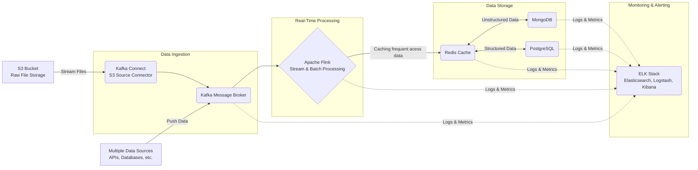
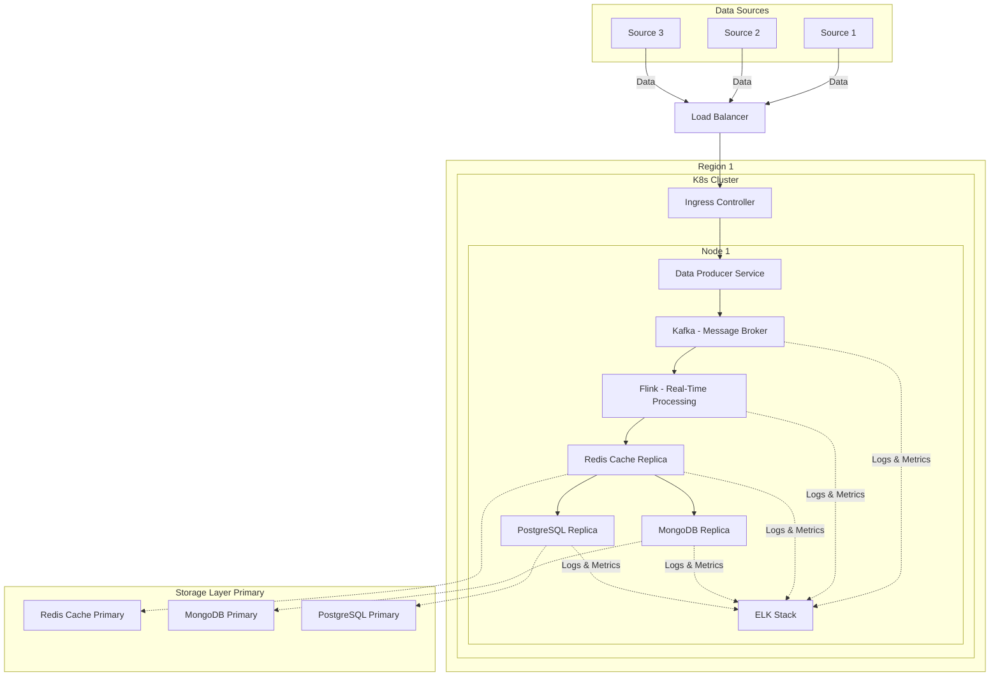

# System Architecture Design for Real-Time Data Processing and Analytics

#### Problem Statement

- You need to design a scalable architecture for a new feature that involves real-time data processing and analytics.
- The system will ingest data from multiple sources, process it in real-time, and store the results in both MongoDB and PostgreSQL for different types of querying.
- The architecture must support high availability, fault tolerance, and scalability. Provide a high-level architecture design with key components and justify your choices.

&nbsp;

# High-Level Architecture Diagram

&nbsp;

## How Do the Services Communicate with Each Other?
#### Note
- This architecture can be scaled by deploying it in Kubernetes (K8s).

## How Does the Kubernetes Deployment for the Above Service Look?
#### Note
- We can have multiple regions to ensure high availability.
- Kubernetes can manage **multiple replicas of pods across different worker nodes for scalability and fault tolerance**.
- For **simplicity**, the diagram below shows **only one node**.

# Key Components

&nbsp;

## 1. Data Ingestion: Apache Kafka
#### Justification:
  - We use Apache Kafka to ingest data from various sources in real-time.
  - Kafka is selected as it best for deliver high throughput and exceptional fault tolerance.
  - It should be able to handle real-time data streams from multiple sources.
  - Kafka ensures data integrity by buffering incoming data streams and thus we won't lose data even if downstream system failures.

## 2. Stream Processing: Apache Flink
#### Justification:
  - Apache Flink is responsible for processing the incoming data streams.
  - Flink excels at handling both batch and streaming data with low latency.
  - Flink ensures that each piece of data is processed exactly once, even in the face of failures thus ensuring data integrity and consistency.

## 3. Data Storage:
### Redis (Cache)
#### Justification:
  - It can be used as a cache to store frequently accessed data and intermediate results
  - Reducing the load on the primary databases and improving query performance.

### MongoDB
#### Justification:
  - MongoDB is chosen for storing unstructured or semi-structured data.
  - Its flexible schema can be help full in easy storage of varied data types
  - Also it supports fast reads for complex queries.

### PostgreSQL
#### Justification:
  - PostgreSQL is chosen for storing structured data and performing complex analytical queries.
  - It provide varioud type of index and supports advanced SQL functions for data analysis.

## 4. Deployment : Kubernetes / Docker
#### Justification:
  - For manageing deployments, scaling, and service recovery.

## 5. API Gateway
#### Justification:
  - Acts as a central point of entry for clients to access data from different microservices and storage systems.
  - For handleing authentication, rate limiting, and request routing.
  - We can design API using REST API or GraphQL

## 6. Load Balancer
#### Justification:
  - To distribute incoming requests across multiple API Gateway instances, ensuring high availability and scalability.

## 7. Monitoring and Logging: Elasticsearch, Logstash, Kibana (ELK)
#### Justification:
  - For centralized logging and log analysis.
  - It allows for easy searching and visualization of logs from all components of the system.

## 8. Scalability and Fault Tolerance:
#### Justification:
  - All components are designed to be horizontally scalable (e.g., by adding more nodes to clusters).
  - Kafka, Flink, MongoDB, and PostgreSQL can all be run in clusters to handle increased load.
  - We can have diffrent read and write replicas for data durability and availability.

## 9. High Availability:
#### Justification:
  - Multiple instances of each component can be deployed across different availability zones to ensure the system remains operational even if one zone fails.
  - The load balancer and API Gateway ensure that requests are routed to healthy instances.

&nbsp;

---

# Conclusion
 - This architecture is designed to meet the requirements for real-time data processing and analytics.
 - It is scalable, fault-tolerant, and supports high availability. By leveraging proven technologies like Kafka, Flink/Spark, MongoDB, PostgreSQL, and Kubernetes, the solution is robust and future-proof.